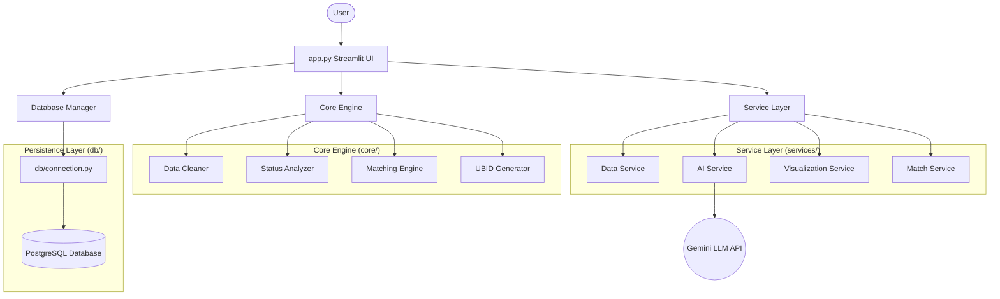
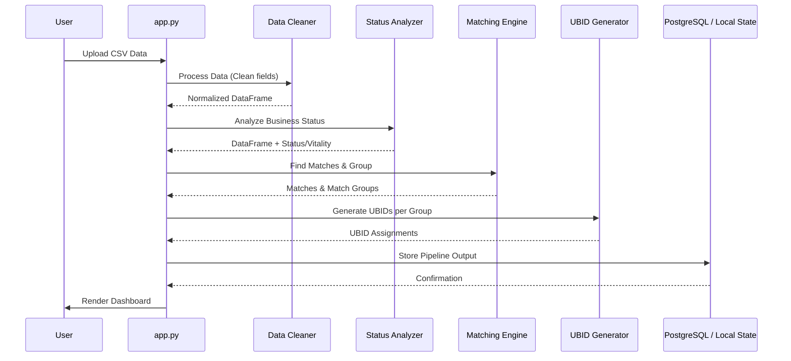
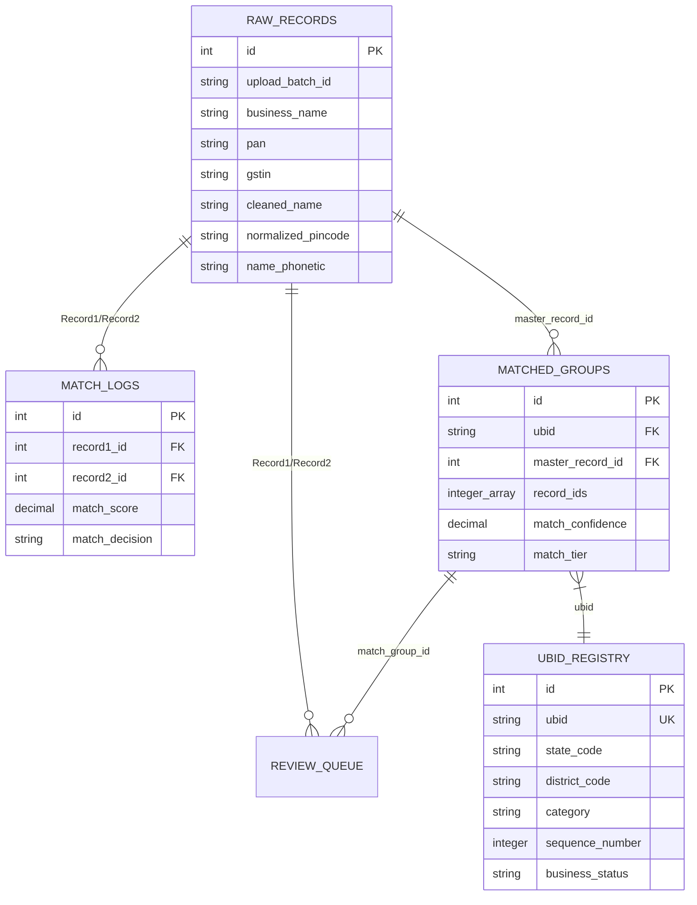

# ApexForge AI - Complete System Architecture Analysis

## 1. Executive Summary
This document provides a comprehensive architectural breakdown of the **ApexForge AI** Unified Business Identity System. ApexForge is a high-performance application designed to ingest, clean, match, and establish a canonical Unified Business Identity (UBID) for disparate business records. It resolves duplicate or fragmented data instances across multiple datasets (e.g., GST, Income Tax, MCA, Labour) by merging exact and fuzzy matches into grouped records sharing a single identifier. 

## 2. System Overview
The system is built as a single-page but multi-view web application using **Streamlit**. Underneath the hood, the application is divided into a presentation layer (`app.py`), a core business logic layer (`core/`), a set of auxiliary services (`services/`), and an optional PostgreSQL database integration layer (`db/`).

**Key Architectural Traits:**
- **Modular Monolith**: Organized by domains (`core`, `services`, `db`) with clear boundary definitions, though deployed as a single Streamlit process.
- **Pipeline-driven Processing**: The core data path follows a strict pipeline: *Upload -> Validate -> Clean/Normalize -> Status Analysis -> Entity Resolution (Matching) -> UBID Generation*.
- **In-Memory & Persistent Modes**: The system gracefully falls back to local DataFrame manipulation (pandas) when no database URL is provided, and persists to PostgreSQL when one is.
- **Quantum-Speed Optimization**: Utilizes vectorized operations (`numpy`), ultra-fast hashing (`murmurhash3`), and parallel execution (`ThreadPoolExecutor`) for high-scale data matching and ID generation.

---

## 3. Architecture Diagrams

### 3.1. High-Level System Architecture

### 3.2. Data Ingestion & Processing Pipeline Flow

### 3.3. Database Relationship Diagram

---

## 4. Module Breakdown

### 4.1. `core/` (Business Logic)
- **`data_cleaner.py`**:
  - **Purpose**: Normalizes raw input data and handles missing values.
  - **Critical Logic**: Uses vectorization and regular expressions to validate PAN and GSTINs. Generates phonetic representations of business names for fuzzy matching.
- **`status_analyzer.py`**:
  - **Purpose**: Determines whether a business is Active, Dormant, or Closed.
  - **Critical Logic**: Compares `last_activity_date` against a reference date, calculating month deltas to assign vitality metrics.
- **`matching_engine.py`**:
  - **Purpose**: Detects exact and fuzzy duplicates to group businesses.
  - **Critical Logic**: Groups via a **Union-Find algorithm**. Applies Tiered rules:
    - **Tier 1**: Exact PAN/GSTIN match (100% confidence).
    - **Tier 2/3**: Uses `rapidfuzz` string similarity alongside Pincode/District overlapping to calculate weighted confidence scores.
- **`ubid_generator.py`**:
  - **Purpose**: Generates the final identity code (e.g., `KA-BAN-TR-4829103`).
  - **Critical Logic**: Contains **Quantum-Speed** enhancements using `numpy` for batch RNG and `mmh3` (MurmurHash3) for fast O(1) collision detection in large datasets. Also utilizes `ThreadPoolExecutor` for concurrent ID assignment.

### 4.2. `services/` (Auxiliary Operations)
- **`ai_service.py`**:
  - **Purpose**: Interfaces with the Gemini LLM for AI-driven explainability.
  - **Critical Logic**: Provides natural language data quality assessments and explains "Why these two records matched" using contextual RAG principles. Implements LRU-style disk caching to mitigate API costs.
- **`data_service.py`**:
  - **Purpose**: Orchestrates the storage of processed pipeline data.
  - **Critical Logic**: Formats dataframes into DB-friendly dictionaries and handles batch insertions to `raw_records`, `matched_groups`, and `ubid_registry`.
- **`visualization_service.py`**:
  - **Purpose**: Processes matching data for graph visualization.
  - **Critical Logic**: Uses `pyvis.network.Network` to build interactive node-edge diagrams showing how distinct records merge into single UBIDs.

### 4.3. `app.py` (Presentation & Routing)
- **Purpose**: Acts as the main entry point and UI controller.
- **Responsibilities**: Maps Streamlit sidebar interactions to page-rendering functions (`render_dashboard`, `render_results_page`, etc.). Manages application global state via `st.session_state`.

### 4.4. `db/connection.py` (Persistence)
- **Purpose**: Manages PostgreSQL connectivity using SQLAlchemy.
- **Responsibilities**: Thread-safe connection pooling, automated schema initialization (`initialize_schema`), and query/dataframe bridging.

---

## 5. Tracing Important Execution Paths

### 5.1. Data Ingestion Flow
1. User uploads a CSV via `app.py` -> `render_upload_page()`.
2. App invokes `pipeline_process(df)`:
   - `DataCleaner.clean_dataframe()` normalizes columns.
   - `StatusAnalyzer.analyze_dataframe()` maps activity to lifecycle states.
   - `MatchingEngine.find_matches()` discovers edges.
   - `MatchingEngine.group_matches()` runs Union-Find to build components.
   - `UBIDGenerator.assign_ubids()` assigns unified IDs.
3. If a database is configured, `DataService.process_full_pipeline()` bulk inserts the records to NeonDB/Postgres.
4. Streamlit state updates and triggers a re-render of the Dashboard.

### 5.2. AI Explainability Flow
1. User clicks "Explain Match" on the Review Queue page.
2. `app.py` triggers `ai_service.explain_match(match_result, record1, record2)`.
3. AI Service checks its local JSON cache (`_cache_key`).
4. If missing, it builds a prompt containing record fields and the engine's similarity score.
5. Sends payload to `generativelanguage.googleapis.com` using the `GEMINI_API_KEY`.
6. Parses JSON response into confidence summaries and UI badges.

### 5.3. "Ask ApexForge AI" Natural Language Search
1. User types a query in the Results Page (e.g., *"Show dormant businesses in Bengaluru"*).
2. `AIReviewService.parse_search_query()` feeds the string to Gemini with a schema constraint.
3. LLM returns structured JSON (e.g., `{"filters": {"state": "karnataka", "status": "dormant"}}`).
4. `app.py` -> `apply_ask_apexforge_filters()` dynamically applies these pandas filters.

---

## 6. Architectural Patterns Detected

1. **Pipeline Architecture**: Processing runs in sequential discrete steps with clearly defined inputs/outputs (Clean -> Analyze -> Match -> Generate).
2. **Strategy/Fallback Pattern**: `ubid_generator.py` attempts quantum/concurrent paths (`numpy`/`mmh3`) but falls back to `secrets` and sequential looping if libraries are missing or fail.
3. **Union-Find / Disjoint Set**: Used in `MatchingEngine` to effectively cluster transitive relationships (If A=B and B=C, then A=B=C).
4. **Service Layer Pattern**: Decoupling complex external calls (LLM, Database, PyVis) into a `services/` directory keeps `core/` isolated and purely mathematical.
5. **Caching Pattern**: AI Service utilizes explicit file-backed caching (`_load_cache_file`, `_store_cache`) to prevent redundant LLM invocations.

---

## 7. Identify: Risks & Bottlenecks

### 7.1. Memory and Scalability Issues
- **In-Memory Pandas Processing**: The entire ingestion pipeline operates on pandas DataFrames held in RAM. Large files (e.g., 500k+ rows) will cause out-of-memory (OOM) exceptions.
- **O(N^2) Matching Risk**: Despite optimization limits (`MAX_CANDIDATES_PER_RECORD = 500`) and index buckets, the matching engine relies on cross-comparing records. As N grows, comparisons scale exponentially.

### 7.2. Tight Coupling
- **app.py Monolith**: `app.py` is nearly 2,300 lines long, containing UI markup, CSS, business orchestration logic, state management, and file reading. This violates Single Responsibility and makes maintenance difficult.

### 7.3. Database Inefficiencies
- **Bulk Insert Architecture**: `connection.py` uses `df.to_sql(method='multi')` which is significantly slower than using Postgres `COPY` commands for massive datasets.

### 7.4. Security Risks
- **LLM Prompt Injection**: The "Ask ApexForge AI" feature accepts raw user text. Without strict sanitization, users could execute prompt injection attacks.
- **Streamlit Local State**: In a multi-user server environment, Streamlit's session state can sometimes bleed if not handled carefully, though it is usually session-isolated. 

### 7.5. Token-Heavy AI Operations
- AI explanations for data quality send large structural samples of the dataset to the LLM. High usage could quickly exhaust API quotas.

---

## 8. Suggested Production-Grade Improvements

1. **Scalability (Data Streaming & Chunking)**:
   - **Improvement**: Replace pandas with **Polars** or **Dask** for lazy execution and out-of-core memory management.
   - **Action**: Modify the ingestion pipeline to process CSVs in chunks rather than loading the entire file into memory at once.
   
2. **Modularization of the Presentation Layer**:
   - **Improvement**: Break `app.py` into a Streamlit multipage application format (`pages/dashboard.py`, `pages/upload.py`, etc.).
   - **Action**: Extract the 500+ lines of CSS into a static `style.css` file and load it via `st.markdown`.

3. **Database Write Optimization**:
   - **Improvement**: Implement PostgreSQL `COPY FROM STDIN` (via `psycopg2` or `asyncpg`) for bulk ingestion to boost write speeds by 10x+.
   
4. **Matching Engine Optimization**:
   - **Improvement**: Replace in-memory nested loops with **Vector Embeddings** (e.g., using pgvector or FAISS). Name embeddings combined with approximate nearest neighbor (ANN) search would instantly scale the matching engine to millions of rows.

5. **Asynchronous Architecture**:
   - **Improvement**: Processing large files blocks the UI thread.
   - **Action**: Offload processing to a background task queue (like **Celery** or **Redis Queue**) and let the Streamlit UI poll for job completion status via websockets or active polling.

## 9. Final Production Readiness Verdict
ApexForge AI is a **highly robust, MVP-ready application** showcasing excellent algorithmic complexity (Union-Find, fast hashing) and beautiful UX. However, it currently functions as a **heavy-client monolith**. To be deployed in a true high-concurrency enterprise production environment, it requires migrating the execution pipeline to background workers (Celery) and transitioning from in-memory Pandas to distributed/chunked dataframes to handle production-scale datasets.
